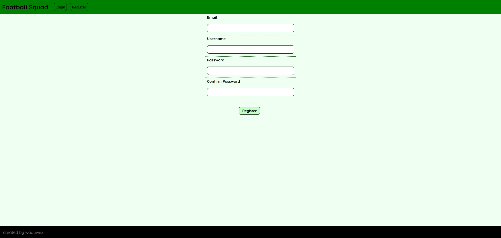

# README
* FootballSquad app with React.
* With this app you can create your custom football squad with current active football
players(From approximately 20000 of the most well-known football players in the world in backend app).
* Footballers

## Features
* State management with Redux.
* HTTP requests to backend with JWT token.
* Drag and drop system for footballers with drag api and touch api.
* Responsive(most likely) football board which uses resize api.

## Showcase
|  |  |  |
|----------|----------|----------|
|  |  |
|    |  |
|    |    |

## Required Config
REACT_APP_BACKEND_URL=

## Credits
[Country flags taken from here](https://github.com/hampusborgos/country-flags)